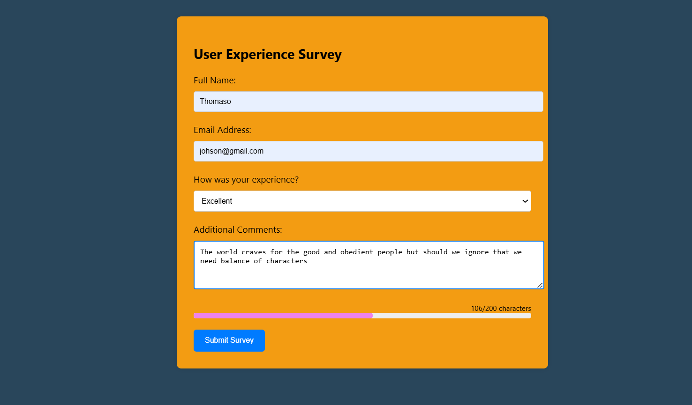

📋 Interactive Survey Form

An interactive, user-friendly survey form built with HTML, CSS, and JavaScript, demonstrating real-time form validation, event listeners, and visual feedback via a dynamic progress bar.

🚀 Features
✅ Form Validation: Checks for name, email format, selected experience level, and minimum comment length before submission.

🟢 Live Character Counter: Shows the number of characters typed in the comment field.

📊 Progress Bar: Visually represents how full the comment box is (color-coded: green, orange, red).

💬 Real-time Feedback: Instant error messages as users interact with the form.

Demo Screenshot.

 Concepts Demonstrated

Event listeners (input, submit)

Form validation logic

Dynamic DOM updates

Styling and transitions

